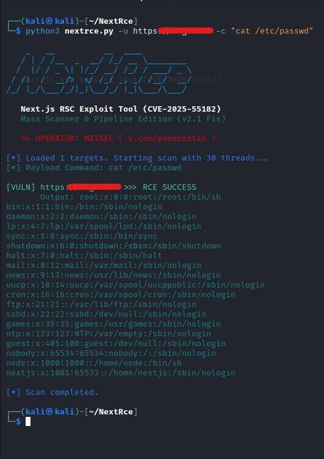

# Executive Summary

During my security research, I identified and successfully exploited a **Critical Remote Command Execution (RCE)** vulnerability affecting **Next.js React Server Components (RSC)**.

The vulnerability allowed arbitrary operating system command execution on the target server.

---

## Vulnerability Details

| Field | Value |
|-------|-------|
| Product | Next.js |
| CVE | CVE-2025-55182 |
| Severity | 🔴 Critical |
| Impact | Remote Command Execution |
| Component | React Server Components |

---

## Proof of Concept

The following command was used to demonstrate successful command execution.

```bash
python3 nextrce.py \
-u https://target.com \
-c "cat /etc/passwd"
```

---

## Demonstration



---

## Technical Details

The vulnerability exists in the React Server Components implementation, allowing an attacker to execute arbitrary commands on the underlying operating system.

Once exploited, the application executes attacker-controlled commands and returns their output.

---

## Impact

An attacker could potentially:

- Execute arbitrary operating system commands.
- Read sensitive files.
- Access application secrets.
- Fully compromise the affected server.

---

## Mitigation

- Upgrade Next.js to the patched release.
- Restrict exposure of vulnerable RSC endpoints.
- Apply the official security patch.
- Continuously monitor for exploitation attempts.

---

## References

- Next.js Security Advisory
- CVE-2025-55182
